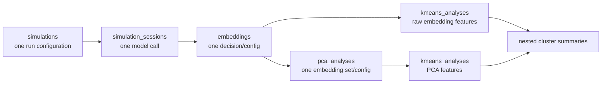

# Simulation and Derived-Analysis Data Schema

This guide describes the five collections that connect a simulation run to
reasoning embeddings and derived PCA/k-means results:



The examples below use shortened identifiers, vectors, and text for
readability. They show one collection document, while a replication JSON file
contains an array of documents.

## Storage locations

| Logical collection | Canonical repository | Replication repository |
| --- | --- | --- |
| `simulations` | MongoDB `simulations` | `data/exp*/simulations.json` |
| `simulation_sessions` | MongoDB `simulation_sessions` | `data/exp*/simulation_sessions.json` |
| `embeddings` | MongoDB `embeddings` | `data/exp*/embeddings.json` |
| `pca_analyses` | MongoDB `pca_analyses` | `data/derived/pca_analyses.json` |
| `kmeans_analyses` | MongoDB `kmeans_analyses` | `data/derived/kmeans_analyses.json` |

Simulation, session, and embedding data are assigned to an experiment during
export. Derived records are shared because one selected embedding set can span
multiple experiments.

MongoDB may hold `datetime` and other BSON values. The replication exporter
serializes dates as ISO strings. Embedding and derived-analysis contracts
already use UTC strings ending in `Z`.

## Relationship and identity summary

| Collection | One document represents | Identity |
| --- | --- | --- |
| `simulations` | One complete simulation configuration/run | Generated UUID `_id` |
| `simulation_sessions` | One model call belonging to a simulation | Generated UUID `_id` |
| `embeddings` | One session decision under one embedding configuration | Session ID + zero-based decision index + embedding-config hash |
| `pca_analyses` | One PCA result for an exact embedding set/configuration | Sorted embedding IDs + PCA-config hash |
| `kmeans_analyses` | One clustering result and its reusable summary runs | Sorted embedding IDs + feature source + clustering-config hash |

## `simulations`

This is a runner-generated, descriptive schema rather than a strict
closed-field validator. The three configuration objects are snapshots of the
settings used for the run and can gain fields as runner features evolve.

```json
{
  "_id": "simulation-uuid",
  "name": "001",
  "phase_name": "phase_2_context",

  "simulation_config": {
    "simulation_mode": "BatchSimulate",
    "target_simulation_n": 100,
    "game_type": "Dictator",
    "output_format": "json",
    "batch_mode": "Independent",
    "batch_simulation_n": 10,
    "decision_length": 1,
    "previous_responses": [],
    "save_messages_n_contents": false,
    "iterative_workers": 10
  },

  "instruction_config": {
    "background": "",
    "personality_traits": "",
    "explain_reasoning": true,
    "explain_reasoning_mode": "basic",
    "split_n": null,
    "theoretical_prediction": false,
    "additional_instructions": [],
    "include_simulation_id": true,
    "context": "Classroom",
    "incentive_size": "Standard",
    "privacy_treatment": "Private",
    "focal_point": false
  },

  "llm_config": {
    "llm_service": "openrouter",
    "model": "openai/gpt-5.2",
    "temperature": 1,
    "frequency_penalty": 1,
    "reasoning_enabled": false
  },

  "extraFlag": [],
  "simulation_sessions": [
    "successful-session-uuid"
  ],
  "failed_sessions": [
    "failed-session-uuid"
  ],
  "n_valid_simulation_results": 100,
  "completed": true,
  "archived": false,
  "notes": [
    "Simulation completed!"
  ],
  "created_at": "2026-07-23T09:00:00",
  "updated_at": "2026-07-23T09:30:00",
  "complete_at": "2026-07-23T09:30:00"
}
```

Important fields:

- `simulation_sessions` contains successful, schema-valid session IDs.
- `failed_sessions` contains API-failed or schema-invalid session IDs.
- `n_valid_simulation_results` counts decisions, not sessions. A batch session
  can contribute multiple decisions.
- `completed` means the target decision count was reached.
- `archived` controls whether runners and embedding orchestration treat the
  simulation as active.
- `complete_at` is the existing field spelling used by the runner.
- `instruction_config.explain_reasoning` is the simulation-level embedding
  gate. If it is false or missing, the embedding orchestrator does not proceed.

## `simulation_sessions`

One session records one attempted model call. The core session fields are
stable, while `result` and optional split-mode fields are extensible.

### Successful session

```json
{
  "_id": "successful-session-uuid",
  "simulation_id": "simulation-uuid",
  "agent_response_success": true,
  "schema_check_pass": true,

  "decisions": [
    [
      [50],
      "Short reasoning text for this decision."
    ],
    [
      [20],
      "Short reasoning text for the next decision."
    ]
  ],

  "result": {
    "result": {
      "number_of_decisions": 2,
      "all_responses": [
        [[50], "Short reasoning text for this decision."],
        [[20], "Short reasoning text for the next decision."]
      ]
    },
    "extra": {},
    "msg": "Success",
    "elapsed_time": 4.2,
    "token_usage": {
      "raw_usage": "<provider usage serialized by the simulation runner>",
      "prompt_tokens": 557,
      "completion_tokens": 3535
    }
  },

  "created_at": "2026-07-23T09:01:00",
  "updated_at": "2026-07-23T09:01:05"
}
```

Decision shape depends on `instruction_config.explain_reasoning`:

```text
reasoning disabled:  decisions[index] = [decision_value, ...]
reasoning enabled:   decisions[index] = [[decision_value, ...], "reason text"]
```

The embedding input for `decision_index = i` is
`session.decisions[i][1]`. `decision_index` is therefore always zero-based and
refers to the stored array order.

For iterative simulations, `result.result` normally contains `response`
instead of `all_responses`. For split reasoning mode, a session may also have:

```json
{
  "split_chunk_index": 1,
  "split_total_chunks": 10
}
```

### Failed session

```json
{
  "_id": "failed-session-uuid",
  "simulation_id": "simulation-uuid",
  "agent_response_success": false,
  "schema_check_pass": null,
  "result": {
    "result": {},
    "msg": "<provider failure>",
    "elapsed_time": 2.1
  },
  "created_at": "2026-07-23T09:02:00",
  "updated_at": "2026-07-23T09:02:03"
}
```

An API failure normally leaves `schema_check_pass: null`. If the provider call
succeeds but the returned decision fails validation, the session instead has
`agent_response_success: true`, `schema_check_pass: false`, and a
`schema_error` message. Failed sessions normally have no `decisions` field and
are not eligible for embedding.

## `embeddings`

This is a strict validated contract. One entity represents:

```text
simulation_session_id + decision_index + canonical embedding_config_hash
```

A successful entity is immutable and is skipped by later matching runs.
Failures remain retryable in a later invocation, with every attempt preserved.

```json
{
  "_id": "reasoning-embedding:<sha256>",
  "simulation_id": "simulation-uuid",
  "simulation_session_id": "successful-session-uuid",
  "decision_index": 0,

  "input_text": "Short reasoning text for this decision.",
  "embedding_config": {
    "model": "openai/text-embedding-model",
    "encoding_format": "float",
    "dimensions": 3,
    "input_type": "query",
    "provider": {
      "order": ["openai"],
      "allow_fallbacks": true
    }
  },
  "embedding_config_hash": "<sha256>",

  "success": true,
  "output": {
    "response_id": "embedding-response-id",
    "resolved_model": "openai/text-embedding-model",
    "object": "embedding",
    "vector": [0.012, -0.034, 0.056],
    "vector_dimension": 3
  },

  "usage": {
    "prompt_tokens": 18,
    "total_tokens": 18,
    "cost": 0.000002,
    "is_byok": false,
    "cost_details": {
      "upstream_inference_cost": 0.000002
    }
  },

  "attempt_count": 1,
  "attempts": [
    {
      "timestamp": "2026-07-23T10:00:00Z",
      "success": true,
      "response_id": "embedding-response-id",
      "resolved_model": "openai/text-embedding-model",
      "usage": {
        "prompt_tokens": 18,
        "total_tokens": 18,
        "cost": 0.000002,
        "is_byok": false,
        "cost_details": {
          "upstream_inference_cost": 0.000002
        }
      },
      "error": null
    }
  ],

  "created_at": "2026-07-23T10:00:00Z",
  "updated_at": "2026-07-23T10:00:00Z",
  "succeeded_at": "2026-07-23T10:00:00Z"
}
```

A failure keeps `success: false`, `output: null`, and `succeeded_at: null`.
The latest failed attempt has a sanitized error:

```json
{
  "timestamp": "2026-07-23T10:00:00Z",
  "success": false,
  "response_id": null,
  "resolved_model": null,
  "usage": null,
  "error": {
    "type": "EmbeddingRequestError",
    "code": "request_failed",
    "message": "Embedding request failed.",
    "status_code": 429
  }
}
```

The complete returned usage object is retained. `cost` is OpenRouter-reported
cost; absent cost is represented as `null`, never reconstructed from a later
pricing table.

## `pca_analyses`

This is a strict validated contract. One entity represents:

```text
sorted unique embedding_ids + canonical pca_config_hash
```

```json
{
  "_id": "pca-analysis:<sha256>",
  "schema_version": 1,
  "embedding_ids": [
    "reasoning-embedding:aaa",
    "reasoning-embedding:bbb"
  ],
  "embedding_set_hash": "<sha256>",

  "pca_config": {
    "n_components": 2,
    "solver": "full",
    "standardize": true
  },
  "pca_config_hash": "<sha256>",

  "status": "complete",
  "output": {
    "coordinates": [
      {
        "embedding_id": "reasoning-embedding:aaa",
        "values": [0.31, -0.82]
      },
      {
        "embedding_id": "reasoning-embedding:bbb",
        "values": [-0.14, 0.57]
      }
    ],
    "n_samples": 2,
    "n_input_dimensions": 1536,
    "n_components": 2,
    "diagnostics": {
      "explained_variance_ratio": [0.64, 0.21],
      "solver": "full",
      "scaling": "standard"
    }
  },

  "attempt_count": 1,
  "attempts": [
    {
      "started_at": "2026-07-23T10:10:00Z",
      "finished_at": "2026-07-23T10:10:01Z",
      "success": true,
      "error": null
    }
  ],

  "created_at": "2026-07-23T10:10:00Z",
  "updated_at": "2026-07-23T10:10:01Z",
  "completed_at": "2026-07-23T10:10:01Z"
}
```

Contract rules:

- `embedding_ids` are sorted and contain no duplicates.
- `coordinates` align one-to-one and in order with `embedding_ids`.
- All coordinates are finite and have the same component count.
- `n_samples`, `n_input_dimensions`, and `n_components` must match the stored
  shapes.
- `diagnostics` is extensible finite JSON for explained variance, loadings,
  preprocessing, solver metadata, and similar future evidence.
- Failed entities have `status: "failed"`, `output: null`, and a sanitized
  failed attempt. A later retry appends an attempt.
- Completed entities are immutable.

PCA and k-means attempts do not contain API usage because those computations
are local. Only model-generated cluster summaries have API usage/cost.

## `kmeans_analyses`

This is a strict validated contract. One entity represents:

```text
sorted unique embedding_ids
+ canonical feature_source
+ canonical clustering_config_hash
```

The feature source is exactly one of:

```json
{"kind": "embeddings"}
```

```json
{
  "kind": "pca",
  "pca_analysis_id": "pca-analysis:<sha256>"
}
```

For a PCA source, the referenced PCA entity must be complete and have exactly
the same `embedding_ids`. PCA component selection belongs in
`clustering_config`, so changing it creates a different k-means identity.

```json
{
  "_id": "kmeans-analysis:<sha256>",
  "schema_version": 1,
  "embedding_ids": [
    "reasoning-embedding:aaa",
    "reasoning-embedding:bbb"
  ],
  "embedding_set_hash": "<sha256>",

  "feature_source": {
    "kind": "pca",
    "pca_analysis_id": "pca-analysis:<sha256>"
  },
  "clustering_config": {
    "n_clusters": 2,
    "random_state": 42,
    "pca_component_indices": [0, 1]
  },
  "clustering_config_hash": "<sha256>",

  "clustering": {
    "status": "complete",
    "output": {
      "assignments": [
        {
          "embedding_id": "reasoning-embedding:aaa",
          "cluster_id": 0
        },
        {
          "embedding_id": "reasoning-embedding:bbb",
          "cluster_id": 1
        }
      ],
      "centroids": [
        {
          "cluster_id": 0,
          "values": [0.31, -0.82]
        },
        {
          "cluster_id": 1,
          "values": [-0.14, 0.57]
        }
      ],
      "n_clusters": 2,
      "n_features": 2,
      "diagnostics": {
        "inertia": 1.25,
        "n_iter": 6
      }
    },
    "attempt_count": 1,
    "attempts": [
      {
        "started_at": "2026-07-23T10:20:00Z",
        "finished_at": "2026-07-23T10:20:01Z",
        "success": true,
        "error": null
      }
    ],
    "updated_at": "2026-07-23T10:20:01Z",
    "completed_at": "2026-07-23T10:20:01Z"
  },

  "summaries": [
    {
      "summary_config": {
        "model": "openai/gpt-5-mini",
        "reasoning": {
          "effort": "low"
        },
        "provider": {
          "order": ["openai"]
        },
        "prompt_version": "cluster-summary-v1",
        "max_tokens": 500
      },
      "summary_config_hash": "<sha256>",
      "status": "complete",

      "clusters": [
        {
          "cluster_id": 0,
          "status": "complete",
          "input_hash": "<sha256>",
          "prompt_hash": "<sha256>",
          "output": {
            "summary": "Decisions in this cluster emphasize fairness.",
            "response_id": "generation-123",
            "resolved_model": "openai/gpt-5-mini",
            "finish_reason": "stop",
            "native_finish_reason": "stop",
            "input_hash": "<sha256>",
            "prompt_hash": "<sha256>",
            "usage": {
              "prompt_tokens": 450,
              "completion_tokens": 90,
              "total_tokens": 540,
              "cost": 0.0012,
              "completion_tokens_details": {
                "reasoning_tokens": 20
              }
            }
          },
          "attempt_count": 1,
          "attempts": [
            {
              "started_at": "2026-07-23T10:21:00Z",
              "finished_at": "2026-07-23T10:21:03Z",
              "success": true,
              "response_id": "generation-123",
              "resolved_model": "openai/gpt-5-mini",
              "finish_reason": "stop",
              "native_finish_reason": "stop",
              "usage": {
                "prompt_tokens": 450,
                "completion_tokens": 90,
                "total_tokens": 540,
                "cost": 0.0012,
                "completion_tokens_details": {
                  "reasoning_tokens": 20
                }
              },
              "error": null
            }
          ],
          "updated_at": "2026-07-23T10:21:03Z",
          "completed_at": "2026-07-23T10:21:03Z"
        },
        {
          "cluster_id": 1,
          "status": "complete",
          "input_hash": "<sha256>",
          "prompt_hash": "<sha256>",
          "output": {
            "summary": "Decisions in this cluster emphasize self-interest.",
            "response_id": "generation-124",
            "resolved_model": "openai/gpt-5-mini",
            "finish_reason": "stop",
            "native_finish_reason": "stop",
            "input_hash": "<sha256>",
            "prompt_hash": "<sha256>",
            "usage": {
              "prompt_tokens": 430,
              "completion_tokens": 75,
              "total_tokens": 505,
              "cost": null
            }
          },
          "attempt_count": 1,
          "attempts": [
            {
              "started_at": "2026-07-23T10:22:00Z",
              "finished_at": "2026-07-23T10:22:03Z",
              "success": true,
              "response_id": "generation-124",
              "resolved_model": "openai/gpt-5-mini",
              "finish_reason": "stop",
              "native_finish_reason": "stop",
              "usage": {
                "prompt_tokens": 430,
                "completion_tokens": 75,
                "total_tokens": 505,
                "cost": null
              },
              "error": null
            }
          ],
          "updated_at": "2026-07-23T10:22:03Z",
          "completed_at": "2026-07-23T10:22:03Z"
        }
      ],

      "created_at": "2026-07-23T10:20:02Z",
      "updated_at": "2026-07-23T10:22:03Z",
      "completed_at": "2026-07-23T10:22:03Z"
    }
  ],

  "created_at": "2026-07-23T10:20:00Z",
  "updated_at": "2026-07-23T10:22:03Z"
}
```

Clustering output rules:

- Assignments align one-to-one and in order with `embedding_ids`.
- Centroid IDs are unique, sorted, and match assigned cluster IDs.
- Centroid vectors are finite and have a consistent feature dimension.
- Clustering output becomes immutable once complete.

Summary rules:

- Multiple `summary_config_hash` entries can reuse one clustering result.
- Every cluster has independent `pending | complete | failed` state and
  append-only attempts.
- A later analysis run can skip completed clusters and retry only failed or
  missing clusters.
- Successful summary attempts retain the complete returned usage object.
  Missing cost becomes `null`; it is not estimated later.
- Only the final summary and provenance hashes are stored. Full prompts,
  duplicated session reasoning text, raw responses, credentials, and model
  reasoning traces are excluded.

## Lifecycle states

| Entity/stage | Initial | Success | Failure | Later behavior |
| --- | --- | --- | --- | --- |
| Embedding entity | `success: false`, no attempts | `success: true`, vector saved | `success: false`, no vector | Success skips forever; failure may receive one later attempt |
| PCA entity | `status: pending` | `status: complete` | `status: failed` | Complete skips; failure may receive a later attempt |
| K-means clustering | `status: pending` | `status: complete` | `status: failed` | Complete clustering can be reused by summaries |
| Per-cluster summary | `status: pending` | `status: complete` | `status: failed` | Completed siblings remain unchanged while failures retry later |

Run/skip/retry policy is deliberately implemented by orchestration or future
mechanism-analysis scripts. Persistence helpers only validate and record legal
state transitions.

## Export and overwrite behavior

The canonical exporter writes an exact one-way public snapshot:

- simulation/session/embedding records are selected per experiment;
- PCA records are exported only if every referenced embedding is exported;
- PCA-derived k-means records additionally require the referenced PCA record;
- pending, failed, and complete derived records are retained for audit;
- managed JSON files are atomically replaced, so stale or replication-local
  records can be removed by a later canonical export;
- collection files are written before derived and top-level manifests.

## Privacy and secrets

- API keys and credential-bearing configuration fields are rejected and never
  stored in embedding or derived-analysis entities.
- Embeddings intentionally retain their exact `input_text` for provenance.
- Simulation sessions retain decisions, reasoning text, and provider result
  metadata because they are the source experiment record.
- K-means summaries retain only the final summary plus `input_hash` and
  `prompt_hash`; they do not duplicate source reasoning text or full prompts.
- Logs and sanitized failure objects must not contain keys, vectors, full
  prompts, raw responses, or complete reasoning text.

## Source-of-truth implementations

- Canonical simulation/session construction:
  `src/simluations/run_simulation.py`
- Shared embedding identity and validation:
  `src/embedding/config.py` and `src/embedding/entities.py`
- Shared PCA identity and validation:
  `src/derived_analysis/pca.py`
- Shared k-means and summary identity and validation:
  `src/derived_analysis/kmeans.py` and
  `src/derived_analysis/kmeans_outputs.py`
- Canonical MongoDB persistence:
  `src/db_ops/`
- Replication local-JSON persistence:
  `src/db_ops/local_json_db.py`
- Exact canonical-to-public export (canonical repository):
  `src/scripts/export-to-replication-folder.py`
